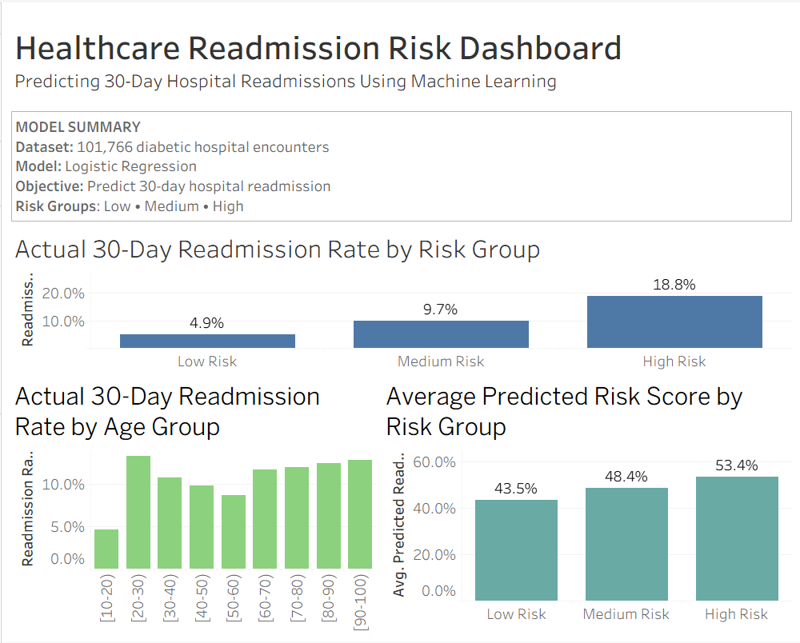

# Healthcare Readmission Risk Analysis

Predicting 30-day hospital readmissions using machine learning to support early risk identification and improve patient care planning.

---

## Project Overview

Hospital readmissions are a major challenge for healthcare providers, leading to increased healthcare costs and poorer patient outcomes. This project develops a machine learning pipeline to predict whether diabetic patients are likely to be readmitted within 30 days after discharge.

The project covers the complete data science workflow, including data preprocessing, exploratory data analysis, feature engineering, model development, threshold tuning, model evaluation, and business-oriented risk stratification. An interactive Tableau dashboard was also created to visualize predicted risk patterns and support decision-making.

---

## Business Problem

Hospital readmissions within 30 days are an important quality metric because they may indicate inadequate discharge planning, insufficient follow-up care, or unresolved clinical issues. Identifying patients who are at higher risk before discharge enables healthcare providers to prioritize interventions, optimize resource allocation, and potentially reduce avoidable readmissions.

The objective of this project is to develop a predictive machine learning model capable of estimating a patient's likelihood of 30-day readmission using historical hospital encounter data.

---

## Dataset

**Source:** UCI Machine Learning Repository – Diabetes 130-US Hospitals Dataset

The dataset contains **101,766** inpatient encounters collected from **130 US hospitals** between 1999 and 2008.

### Dataset Characteristics

| Metric | Value |
|---------|------:|
| Total Records | 101,766 |
| Original Features | 50 |
| Target Variable | Readmission Status |
| Positive Class | Readmitted within 30 days (`<30`) |
| Machine Learning Task | Binary Classification |

The original target variable was transformed into a binary classification problem:

- **1** → Readmitted within 30 days
- **0** → Readmitted after 30 days or not readmitted

---

## Project Pipeline

The project follows a complete end-to-end healthcare analytics workflow:

```
Raw UCI Diabetes Dataset
            │
            ▼
Data Understanding
            │
            ▼
Data Preprocessing
            │
            ▼
Feature Engineering
            │
            ▼
Baseline Logistic Regression Model
            │
            ▼
Model Comparison
(Logistic Regression, Random Forest, Gradient Boosting)
            │
            ▼
Threshold Tuning
            │
            ▼
Risk Stratification
            │
            ▼
Interactive Tableau Dashboard
            │
            ▼
Business Recommendations
```

---

## Repository Structure

```
healthcare-readmission-risk-analysis/
│
├── data/
│   ├── raw/
│   └── processed/
│
├── images/
│   └── healthcare_dashboard.png
│
├── models/
│
├── notebooks/
│   ├── 01_data_understanding.ipynb
│   ├── 02_data_preprocessing.ipynb
│   ├── 03_model_preparation_and_baseline_model.ipynb
│   ├── 04_model_analysis_and_feature_importance.ipynb
│   ├── 05_model_comparison.ipynb
│   ├── 06_threshold_tuning_and_healthcare_recommendations.ipynb
│   └── 07_conclusions_and_business_recommendations.ipynb
│
├── sql/
│
├── tableau/
│   └── healthcare_readmission_dashboard.twb
│
├── README.md
└── requirements.txt
```
---

# Model Performance

Three machine learning models were evaluated for predicting 30-day hospital readmissions.

| Model | Accuracy | Precision | Recall | F1-Score | ROC-AUC |
|-------|---------:|----------:|-------:|---------:|--------:|
| Logistic Regression | 0.661 | 0.180 | 0.574 | 0.274 | 0.671 |
| Random Forest | 0.650 | 0.182 | 0.609 | 0.280 | **0.681** |
| Gradient Boosting | 0.889 | 0.583 | 0.006 | 0.012 | 0.678 |

### Final Model Selection

Although Gradient Boosting achieved the highest overall accuracy, it identified very few patients who were actually readmitted within 30 days, resulting in extremely low recall.

Because this is an imbalanced healthcare classification problem, recall and ROC-AUC were considered more appropriate evaluation metrics than accuracy alone.

**Random Forest** achieved the best balance between discrimination and sensitivity and was selected as the final model for threshold tuning and risk stratification.

---

# Tableau Dashboard

An interactive Tableau dashboard was developed to communicate the key findings from the predictive model.

The dashboard summarizes three major insights:

- **Risk Stratification:** High-risk patients experienced substantially higher observed readmission rates than low-risk patients.
- **Age-Based Analysis:** Readmission rates generally increased across older patient groups.
- **Predicted Risk Scores:** The model assigned progressively higher average readmission probabilities across Low-, Medium-, and High-risk groups.

### Dashboard Preview



The dashboard supports healthcare decision-making by presenting model outputs in an intuitive and business-friendly format.

---

# SQL Analysis

The repository also includes SQL scripts for exploratory healthcare analytics.

The SQL queries demonstrate how the processed dataset can be analyzed using a relational database to answer common healthcare questions, including:

- Overall 30-day readmission rate
- Readmission rate by age group
- Readmission rate by medical specialty
- Hospital utilization by readmission status
- Patient medication and diagnosis complexity

A helper script (`load_data_to_sqlite.py`) is included to load the processed CSV into a SQLite database, making the SQL queries fully reproducible.

---

# Technologies Used

| Category | Technologies |
|----------|--------------|
| Programming | Python |
| Data Analysis | Pandas, NumPy |
| Visualization | Matplotlib, Seaborn, Tableau |
| Machine Learning | Scikit-learn |
| Model Evaluation | ROC-AUC, Precision, Recall, F1-score |
| Development | Jupyter Notebook, Git, GitHub |

---

# How to Run

1. Clone the repository

```bash
git clone https://github.com/HarshiniKarella/healthcare-readmission-risk-analysis.git
```

2. Install the required packages

```bash
pip install -r requirements.txt
```

3. Run the notebooks in numerical order:

```
01_data_understanding.ipynb
02_data_preprocessing.ipynb
03_model_preparation_and_baseline_model.ipynb
04_model_analysis_and_feature_importance.ipynb
05_model_comparison.ipynb
06_threshold_tuning_and_healthcare_recommendations.ipynb
07_conclusions_and_business_recommendations.ipynb
```